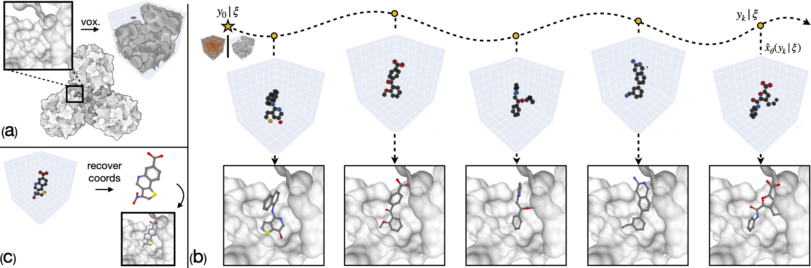
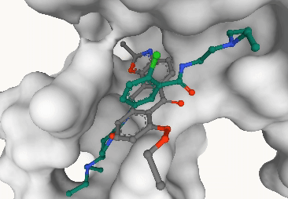

# VoxBind: Structure-based drug design by denoising voxel grids

This repository contain the implementation of the paper [Structure-based drug design by denoising voxel grids](https://arxiv.org/abs/2405.03961v1):

```
@inproceedings{pinheiro2024voxbind,
  title={Structure-based drug design by denoising voxel grids},
  author={Pinheiro, Pedro O and Jamasb, Arian and Mahmood, Omar and Sresht, Vishnu and Saremi, Saeed}
  booktitle={ICML},
  year={2024}
}
```
VoxBind is a protein pocket-conditional generative model operating on voxelized molecules. Given a protein pocket, VoxBind generate binding ligands following the (conditional) "walk-jump sampling" approach: (i) sample smoothed molecules with Langevin MCMC and (ii) estimate clean molecule with a voxel denoiser.




## Workflow
We assume the user have anaconda (or, preferably mamba) installed and has access to GPU.

### 1. Install the environment
```bash
mamba env create -f env.yaml
conda activate voxbind
pip install -e .
```

### 2. Prepare Crossdocked data

- Download ` split_by_name.pt` and `crossdocked_pocket10.tar.gz` from this [link](https://drive.google.com/drive/folders/1CzwxmTpjbrt83z_wBzcQncq84OVDPurM) (provided by TargetDiff authors, see their [README](https://github.com/guanjq/targetdiff)), place in `dataset/data/` and decompress with `tar xvzf crossdocked_pocket10.tar.gz`.
- Run the following command
```bash
 cd voxbind/dataset; python preprocess_crossdocked.py
```
This will take a couple of hours to be done. The script will generate the following files in `dataset/data/` folder:
- `train_data.pt`: contains the train/val splits
- `test_data.pt`: contains the test split


### 3. Train VoxBind
To train a voxbind model with noise level 0.9, run:
```bash
CUDA_VISIBLE_DEVICES=0,1,2,3 python train.py smooth_sigma=0.9
```

To train a voxbind model with noise level 1.0, run:
```bash
CUDA_VISIBLE_DEVICES=0,1,2,3 python train.py smooth_sigma=1.0
```
These scripts will save the results (logs and checkpoints) in `exps/exp_sig0.9` and `exps/exp_sig1.0`, respectively. See `configs/config_train.yaml` for other training options. Eg, use the flag `wandb=True` to log experiments on wandb.

### 4. Sample with VoxBind on Crossdocked dataset
To sample with a pretrained checkpoint, run, e.g.,
```bash
python sample.py pretrained_path=exps/exp_sig0.9 wjs.split=val wjs.n_samples_per_pocket=10 wjs.n_targets=100
```

This script will generate 10 samples for each of the 100 targets on the validation set using the checkpoint located in `exps/exp_sig0.9`. The generated molecules will be saved in `exps/exp_sig0.9/samples/`. See `configs/config_sample.yaml` for other sampling options.

### 5. Sample with VoxBind from a provided protein pocket
The script `sample_from_file.py` allows us to easily sample with VoxBind from a given protein pocket.

As an example, we will show how to sample from the protein pockets [`8UWP`](https://www.rcsb.org/structure/8UWP) and [`6AU3`](https://www.rcsb.org/structure/6AU3), two of the targets proposed in [CACHE 6 challenge](https://cache-challenge.org/challenges/finding-ligands-targeting-the-triple-tudor-domain-of-setdb1). You can find the protein pdbs and the (co-crystallized) ligand sdfs in `examples/`. These files have been downloaded from PDB datasbase (note that we remove all the water and heteroatoms from the pdb file).

To generate 20 ligands _de novo_ given the protein pocket 8UWP (the default) above, simply run:
```bash
python sample_from_file.py pretrained_path=exps/exp_sig0.9/ n_samples=20
```
This script will save the generated ligands into a single sdf file located in `exps/exp_sig0.9/sample_from_file/8UWP/denovo/samples.sdf`. We also save the target pdb and the ground truth ligand on the sample folder. Below we show the 8UWP pocket, the ground-truth ligand and generated samples:
<div style="text-align: center;">
    
</div>

See `config/config_sample_from_file.yaml` to see all the options for sampling from file.
For example, if you want to sample from the pocket 6AU3 starting from crystalized ligand (ie, initialize the Langevin MCMC chain with the ligand provided on PDB), run:
```bash
python sample_from_file.py \
    pretrained_path=exps/exp_sig0.9/ \
    target_pdb=../examples/6AU3/6au3.pdb \
    ligand_sdf=../examples/6AU3/6au3_B_BWM.sdf \
    wjs.chain_init=ligand \
    wjs.warmup=0 \
    wjs.steps=100 \
    wjs.max_steps=100
```

## License
This project is under the Apache license, version 2.0. See LICENSE for details.
